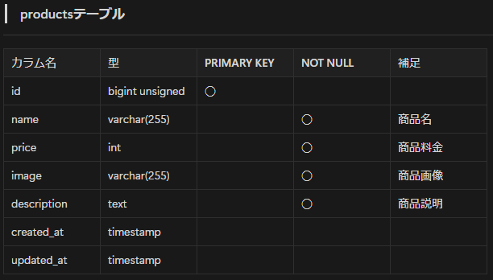
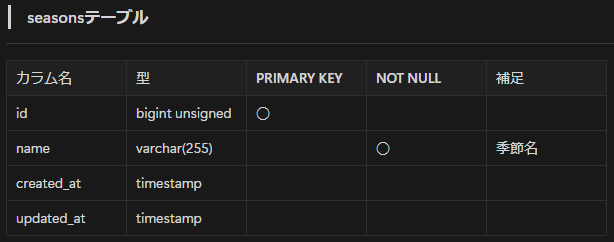
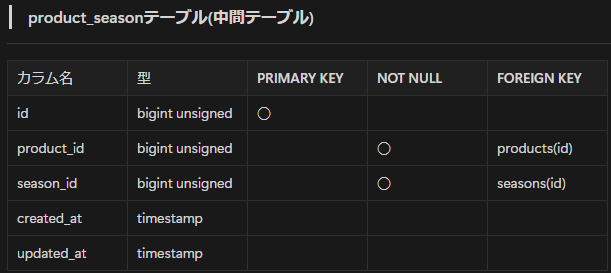
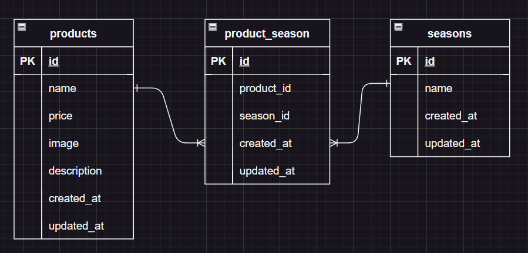

# サービス名

## もぎたて

## 機能一覧
**商品一覧ページ /products**
- 商品検索機能

**商品詳細ページ /products/{productId}**
- 登録情報更新
- 登録削除

**商品登録ページ /products/register**

## 環境構築

**Docker ビルド**

1. GitHub からクローン

```bash
git clone git@github.com:yoshikiakazawa/mogitate.git
```

2. DockerDesktop アプリを立ち上げる

3. 複数コンテナを一括で作成・起動

```bash
docker-compose up -d --build
```

> _Mac の M1・M2 チップの PC の場合、`no matching manifest for linux/arm64/v8 in the manifest list entries`のメッセージが表示されビルドができないことがあります。
> エラーが発生する場合は、docker-compose.yml ファイルの「mysql」内に「platform」の項目を追加で記載してください_

```bash
mysql:
    platform: linux/x86_64(この文追加)
    image: mysql:8.0.36
    environment:
```

**Laravel 環境構築**

1. PHP コンテナ内にログイン

```bash
docker-compose exec php bash
```

2. 必要なパッケージをインストール

```bash
composer install
```

3. 「.env.example」ファイルを 「.env」ファイルに命名を変更。または、新しく.env ファイルを作成

```bash
cp .env.example .env
```

4. .env に以下の環境変数を追加

**DB 設定**

```text
DB_CONNECTION=mysql
DB_HOST=mysql
DB_PORT=3306
DB_DATABASE=laravel_db
DB_USERNAME=laravel_user
DB_PASSWORD=laravel_pass
```

**mail 設定、stripe 設定記載**

5. マイグレーションの実行

```bash
php artisan migrate
```

6. シーダーの実行

```bash
php artisan db:seed
```

7. アプリケーションキーの作成

```bash
php artisan key:generate
```

## 使用技術(実行環境)

- PHP 7.4.9
- Laravel Framework 8.83.27
- MySQL 8.0.36

## テーブル設計





## ER 図



## URL

- 開発環境：http://localhost/
- phpMyAdmin：http://localhost:8080/
